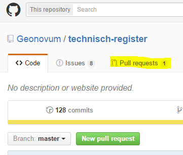
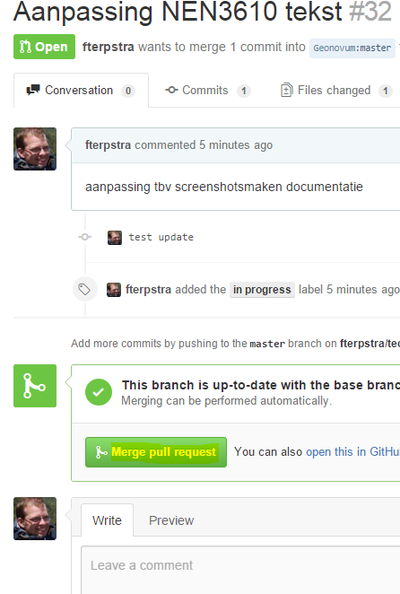
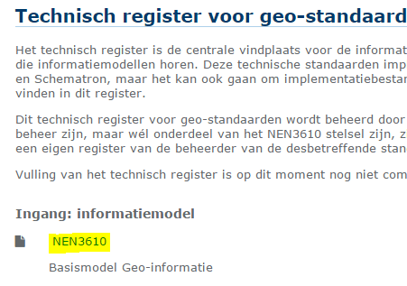
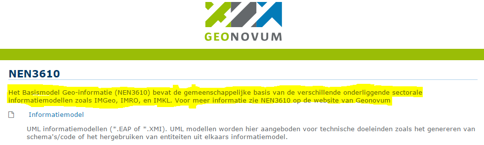
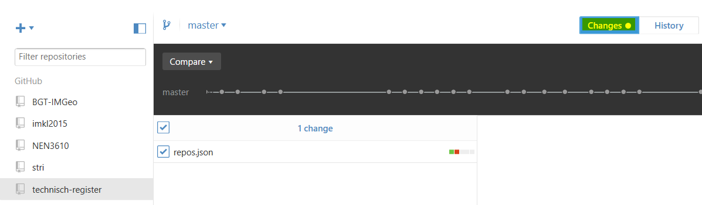
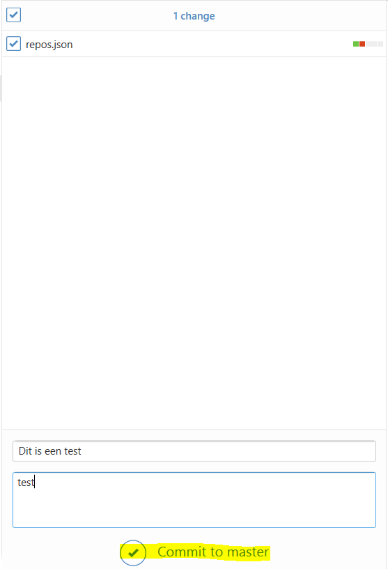

Toevoegen nieuw informatiemodel
===============================

Voor het toevoegen van een nieuw informatiemodel dient het bestand repos.json aangepast worden. Er zijn twee mogelijkheden, ofwel de beheerder van het nieuwe informatiemodel heeft dit zelf gedaan en in GitHub een pull request gedaan, danwel de beheerder van het informatiemodel levert een tekst aan die je als beheerder van het technisch register in repos.json moet invoeren.

Via pull request
----------------

In de handleiding voor beheerders van informatiemodellen staat beschreven hoe zij een pull request moeten doen. Als beheerder van het technisch register krijg je een bericht van de GitHub repository van het technisch register wanneer dit heeft plaats gevonden. Ga naar de GitHub webpagina:

En klik op Pull requests

Klik vervolgens op de openstaande pull request

Door hier op files changed te klikken kan je de veranderingen bekijken. Indien je het met de voorgestelde verandering eens bent kan je via een merge hem accepteren.

Klik op “Merge pull request” om de voorgestelde verandering over te nemen.

Indien je het er niet mee eens bent kan je de pull request afsluiten, eventueel voorzien van commentaar.

Klik hiervoor op “close and comment”

Aangeleverde tekst
------------------

De beheerder van een informatiemodel levert via de mail een verzoek aan met daarin de tekst. Deze dient in repos.json toegevoegd te worden.

Haal hiervoor de laatste versie van repos.json op uit github. Dit kan met de github applicatie door een sync te doen.

Ga naar de technisch register repository en klik rechts boven op sync.

Klik vervolgens rechts op technisch-register en kies “open in explorer”. Open de repos.json die in deze folder staat in je favoriete editor. Pas vervolgens repos.json aan.

Hieronder is een voorbeeld van de definitie van NEN3610 in repos.json:

| {   |
|-----|
|     |
|     |
|     |
|     |
|     |
|     |
|     |

Hierna volgt een uitleg welk veld waar terug te vinden is op het register.

Id: is een intern gebruikte identifier, verschijnt niet op de website

Titel: is de titel van de pagina van het informatie model

Titel\_kort: is de hyperlink naar de pagina van het informatiemodel op de hoofdpagina

Beschrijving: is de lange beschrijving op de pagina van het informatiemodel

Beschrijving\_kort: de korte beschrijving onder de hyperlink op de hoofdpagina maximaal 58 karakters

URL: dit is de url van de github repository waarin het informatiemodel te vinden is.

Nadat repos.json is aangepast wordt deze in github gezet middels een commit.

Klik op changes, je ziet nu staan dat repos.json is aangepast.

Voeg een beschrijvende tekst toe en klik op “Commit to master”. De aangepaste repos.json staat nu in github.

Plaatsen aanpassing op technisch register
-----------------------------------------

Nadat repos.json is aangepast dient deze op het technisch register geplaatst te worden

Log in op de server van het technisch register middels secure shell toegang(ssh). Hiervoor kan je bijvoorbeeld het programma putty gebruiken.

Log in met het username/wachtwoord van de beheerder ga naar de cgi-bin directory en doe een git-pull:

Bij een volgende release van een informatiemodel wordt het technisch register aangepast met de toegevoegde tekst. Geonovum is beheerder van meerdere informatiemodellen en kan in GitHub pre-releases en releases doen om dit te bereiken. Je kan ook de aanleverende beheerder vragen om zelf een pre-release en release te doen. (zie de handleiding voor beheerders informatiemodellen voor gedetailleerde instructies).

Laatste en meest bewerkelijke alternatief is om het herbouwen van de pagina’s handmatig af te trappen. Dit kan door in de CGI-bin directory het commando “cat github-payload.json | python build.py” uit te voeren. Dit bouwt standaard de webpagina’s voor de staging omgeving opnieuw op. Door in het bestand github-payload.json de waarde pre-release op “false” te zetten wordt en het commando nogmaals uit te voeren wordt ook productie aangepast.

N.B. de beheerder van het informatie model moet hebben ingesteld dat zijn/haar repository push berichten verstuurd naar het technisch register bij nieuwe releases. Dit staat beschreven in de handleiding voor beheerders van informatiemodellen.

Aanpassen tekst website
=======================

Deployen code uit github
========================

Technisch ontwerp
=================

Toegang tot server
==================

Testen
======

Afhankelijkheden
================
